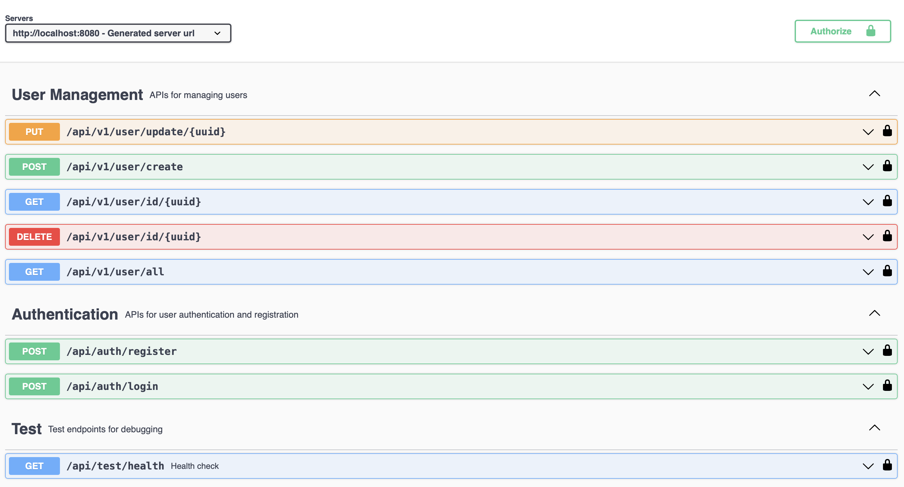
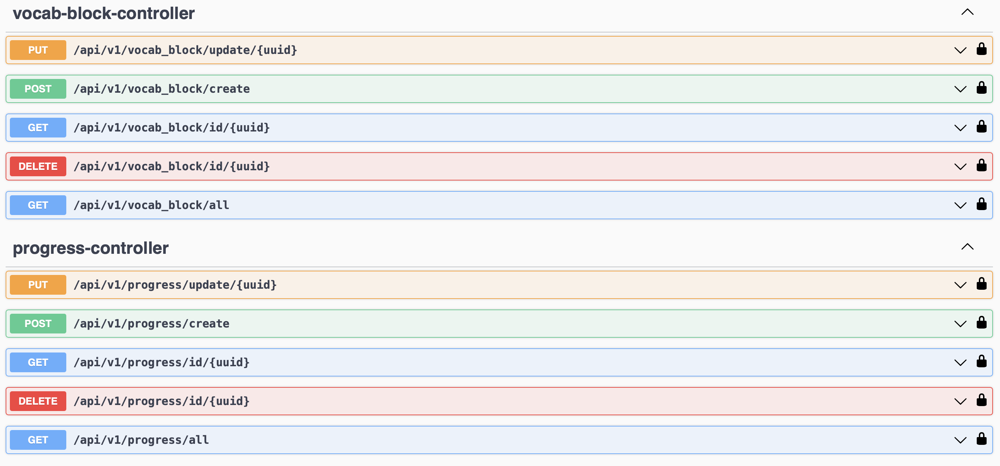
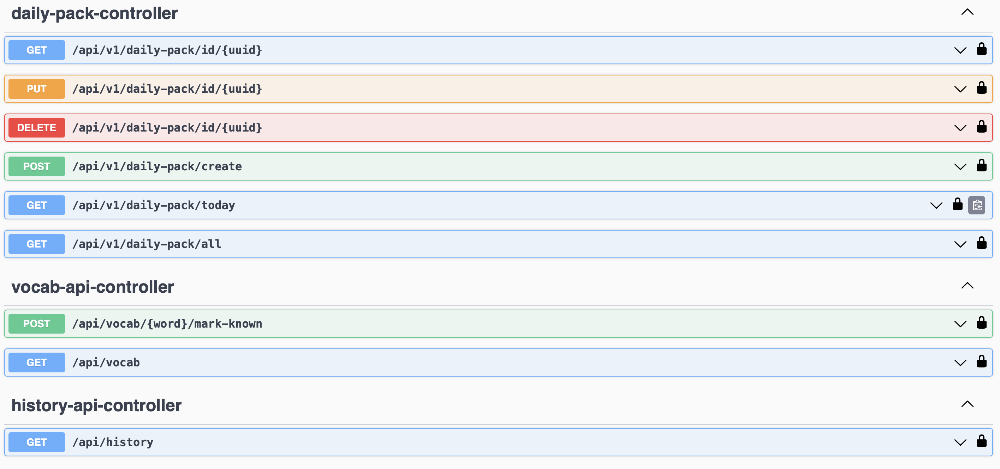

Language Learning Assistant

Language Learning Assistant is a backend service that provides users with daily short study packs for language learning.
Each pack contains 5 words, a short text (5–8 sentences), and 1–2 exercises.
The project demonstrates integration with an LLM (OpenAI API) and serves as a fully functional backend service.

Project Overview

Language Learning Assistant is designed to provide users with a simple,
personalized, and engaging way to learn a new language every day.
Each daily pack delivers 5 carefully selected words, a short contextual text, and interactive exercises,
adapting to the user’s language level and learning pace.

By leveraging AI for content generation, the project demonstrates modern backend development,
API design, and integration with large language models. The assistant makes language learning fast,
easy, and affordable, offering a personalized approach that adapts to users’ knowledge and progress.
Users can access learning materials anywhere, anytime, and track their progress over time.

This project showcases practical skills in:
- Building secure and scalable backend services (Spring Boot, JWT, PostgreSQL)
- Integrating AI for dynamic content generation (OpenAI API)
- Designing user-focused features such as progress tracking, vocabulary management, and daily learning packs
- Writing clean, maintainable code with proper testing (JUnit) and documentation (Swagger/OpenAPI)

It’s an example of creating real-world solutions that combine technical skills with user-centric design,
demonstrating the ability to deliver functional and innovative applications.

Features 

MVP Functionalities
1. User Registration & Login – secure authentication using JWT and password hashing with bcrypt.
2. Onboarding – users select target language, native language, current level (A0–C2), and preferred daily word count (default: 5).
3. Daily Pack Generation – generates 5 new words + short text + 1 gap-fill + 2 multiple-choice exercises.
4. View Current / Last Daily Pack – check daily study packs and their status (READY / PENDING).
5. Complete Exercises / Track Progress – submit answers and store results (completed + score).
6. Personal Vocabulary – all generated words with the ability to mark them as “known”.
7. History – list of past daily packs with date, status, and score.
8. API Documentation – accessible via Swagger/OpenAPI.

Non-Functional Requirements

- API response time for ready packs < 500ms.
- Daily pack generation runs asynchronously; pending packs return status PENDING.
- Database: PostgreSQL (or another RDBMS).
- Security: JWT authentication for secured endpoints.
- Logging: key events such as pack creation and AI call errors.
- LLM constraints: retry twice on failure, cache responses for 24h.

Technologies Used

- Java 19
- Spring Boot
- Spring Security & JWT
- Hibernate & JPA
- PostgreSQL
- Maven
- Lombok for boilerplate reduction
- OpenAI API for text and exercise generation
- Swagger for API documentation
- JUnit for unit testing
- Docker (optional for database and service setup)

API Overview
- POST /api/auth/register – register a new user
- POST /api/auth/login – login and receive JWT
- GET /api/v1/daily-pack/today – get today’s daily pack
- POST /api/v1/daily-pack/{id}/complete – submit completed exercises
- GET /api/v1/vocab – list personal vocabulary
- POST /api/v1/vocab/{word}/mark-known – mark a word as known/unknown
- GET /api/v1/history – retrieve history of past packs

Below is a snapshot of all API endpoints from Swagger:

Running Locally
1. Clone the repository: git clone <repo-url>
2. Configure environment variables for PostgreSQL and OpenAI API key.
3. Build the project with Maven: mvn clean install
4. Run the application: mvn spring-boot:run
5. Access API documentation at: http://localhost:8080/swagger-ui.html

Testing
Unit tests are written with JUnit and cover key service and repository layers.

